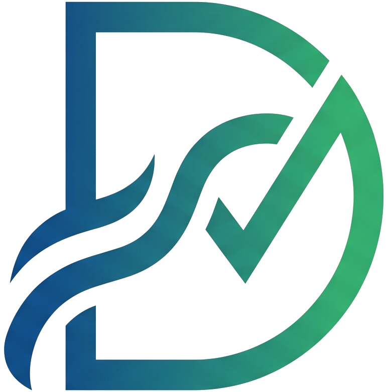
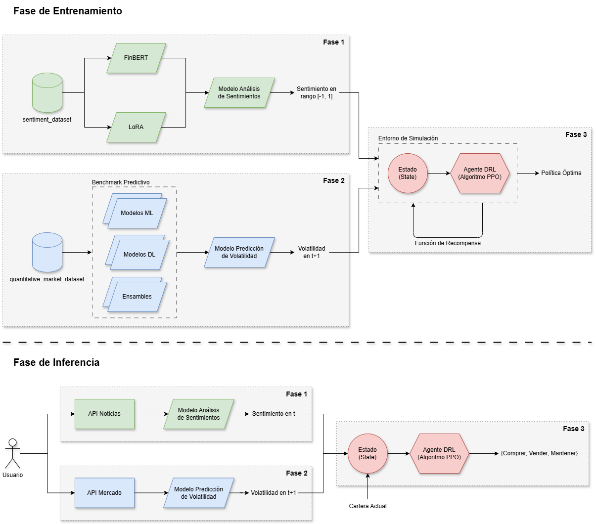

<div align="center">
  
</div>

<div align="center">
  <h1>D.R.E.A.M.</h1>
  <strong>Arquitectura Multi-Agente para Trading basada en Fusión de Sentimiento y Volatilidad</strong>
</div>

<br clear="all">
<br>


<div>
  <blockquote>
    <strong>Trabajo Fin de Máster (TFM)</strong><br>
    Máster Universitario en Inteligencia Artificial<br>
    <em>Universidad Internacional de La Rioja (UNIR)</em>
  </blockquote>
</div>

<br clear="all">

---

## 📖 Sobre el Proyecto

**D.R.E.A.M.** es un ecosistema avanzado de inversión autónoma que combina Procesamiento de Lenguaje Natural (NLP), Modelos Clásicos de Series Temporales y Aprendizaje por Refuerzo Profundo (Deep Reinforcement Learning). El objetivo del proyecto es crear un agente inteligente capaz de gestionar una cartera multi-activo de manera dinámica, optimizando el binomio rentabilidad-riesgo en diferentes ciclos de mercado.

El sistema se compone de tres fases fuertemente acopladas:
1. **Módulo de Sentimiento:** Extracción del sentimiento del mercado a partir de noticias financieras y titulares, utilizando explicabilidad (SHAP) para entender qué palabras dirigen el sentimiento.
2. **Oráculo de Volatilidad:** Predicción adaptativa de la volatilidad esperada a corto plazo para cada activo.
3. **Agente Autónomo de Trading:** El cerebro del sistema. Recibe la volatilidad, el sentimiento macroeconómico y los retornos históricos para rebalancear la cartera dinámicamente y ejecutar órdenes de compra/venta maximizando el *Sharpe Ratio*.

<div align="center">
  
</div>

---

## 🗂️ Estructura del Repositorio

El repositorio está organizado de la siguiente manera:

*   📂 **`dashboard/`**: Contiene la interfaz gráfica interactiva construida con Streamlit.
*   📂 **`src/`**: Código fuente principal del proyecto.
    *   `agent/`: Entornos de entrenamiento de OpenAI Gym (`dream_env.py`), generadores de datos sintéticos basados en Wyckoff y empíricos (`data_feed.py`), y motor de inferencia PPO (`inference.py`).
*   📂 **`models/`**: Binarios y pesos de los modelos PPO entrenados listos para inferencia (`.zip`) y escaladores (`.pkl`).
*   📂 **`data/`**: Datasets pre-procesados para el entrenamiento y backtesting.
*   📂 **`notebooks/`**: Cuadernos Jupyter con análisis exploratorios, validación de las fases y explicabilidad.
*   📂 **`img/`**: Recursos gráficos, logos y resultados de gráficas de evaluación.

---

## 🚀 Instalación y Configuración

Para garantizar que el proyecto utilice la **GPU** y no la versión de CPU por defecto, es **obligatorio** instalar PyTorch manualmente antes de procesar el archivo `requirements.txt`. 

Si se instala el archivo de requerimientos primero, librerías como `lightning` o `pytorch-forecasting` podrían instalar una versión genérica de PyTorch que no detectará tu hardware.

### 1. Crear y activar el entorno (Conda recomendado)
```bash
conda create -n dream_tfm python=3.13.5
conda activate dream_tfm
```

### 2. Instalar PyTorch con binarios de CUDA
```bash
pip install torch torchvision torchaudio --index-url https://download.pytorch.org/whl/cu128
```

### 3. Instalar el resto de dependencias
```bash
pip install -r requirements.txt
```

---

## 🖥️ Uso: Ejecutar el Dashboard Interactivo

El proyecto incluye un completo **Dashboard analítico e interactivo** donde puedes visualizar el rendimiento de las tres fases, probar el generador sintético de Wyckoff y realizar backtests en tiempo real con el Agente PPO.

Para iniciarlo, ejecuta el siguiente comando en la raíz del proyecto:

```bash
streamlit run dashboard/app.py
```

Esto abrirá automáticamente una ventana en tu navegador web por defecto (generalmente en `http://localhost:8501`).

---

## 👥 Autores

Este TFM ha sido desarrollado conjuntamente por:

*   **Francisco Javier Gómez Pulido** 
    [](https://www.linkedin.com/in/frangomezpulido)
    [](https://github.com/fragompul)
*   **David Suárez Moreno** 
    [](https://www.linkedin.com/in/david-suárez-moreno-957942253)
    [](https://github.com/davidmoreno13)
*   **Roberto Serrano Zampaña** 
    [](https://www.linkedin.com/in/robertoserranozampa%C3%B1a)
    [](https://github.com/Titaxo)
